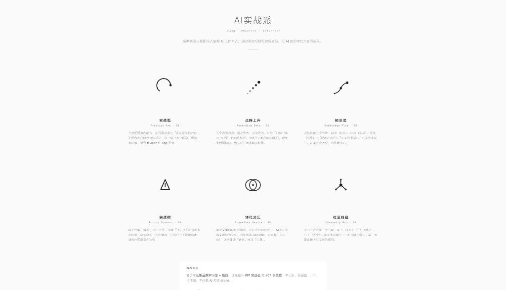

# AI 编程实战：用 Skill 给「康健AI实战派」做品牌 Logo

> 工具实践案例：如何用 Cursor + Agent Skill，在不配图像 API Key 的前提下，完成「需求澄清 → 多方案生成 → 反馈迭代 → 个人 IP 融合」的完整 Logo 设计闭环。

---

## 案例背景

### 问题现象

- **业务需求**：为社群「AI实战派」设计长期可用的极简社区 Logo；完整品牌名实际是「康健AI实战派」，需要兼顾社群定位与「康健 / KJ」个人辨识度。
- **品牌定位**：帮助普通人和职场人掌握 AI 工作方式，通过真实项目和持续实践，把 AI 知识转化为实际成果。核心不是学某一个 AI 工具，而是「在实战中学习、在实战中成长、在实战中改变」。
- **约束**：
  - 不想单独申请 Gemini / remove.bg / Recraft 等图像 API Key
  - 希望产出可编辑的矢量稿（SVG），方便后续改色、做头像、做徽章
  - 希望过程可复现——下次换品牌也能照着跑

### 初步假设

当时第一反应是：

> 「做 Logo = 用 AI 画图。装一个 logo skill，配几个 Key，批量出图，挑一张就行。」

这个假设把 Logo 设计当成了「图像生成任务」，忽略了三件事：

1. 品牌 Logo 的核心往往是**可缩放的符号系统**，不是一张漂亮海报
2. 依赖外部 Key 的 skill，会在环境门槛上直接卡死
3. 真正拉开质量差距的，不是「一次生成 20 张」，而是**反馈驱动的第二轮定向迭代**

---

## 排查 / 实现过程

### 第 1 阶段：踩坑——装错了依赖 Key 的 skill（约 10 分钟）

先尝试安装：

```bash
npx skills add https://github.com/resciencelab/opc-skills --skill logo-creator --yes
```

读完 `SKILL.md` 发现前置依赖是：

| 依赖 | 用途 |
|------|------|
| `GEMINI_API_KEY` | 生成图像 |
| `REMOVE_BG_API_KEY` | 去背景 |
| `RECRAFT_API_KEY` | PNG 转 SVG |
| `nanobanana` skill | 实际调用图像生成脚本 |

没有 Key 就跑不起来，于是直接删除，避免「装了却用不了」的半成品污染项目。

#### AI 协作方式

- **给了 AI**：安装命令 + 「我没有 Key，能不能用」
- **AI 做了什么**：读 skill 前置条件，逐项对照环境，结论是「核心链路全挂外部 API」
- **为什么有效**：先审依赖再开工，比装完再踩坑省一轮

**关键发现**：不是所有「logo skill」都适合无 Key 环境。选型时先看生成链路是「写 SVG」还是「调图像 API」。

---

### 第 2 阶段：换轨——选中「SVG 优先」的 logo-generator（约 15 分钟）

安装：

```bash
npx skills add https://github.com/op7418/logo-generator-skill --skill logo-generator --yes
```

对照文档后的结论：

| 能力 | 要不要 Key |
|------|------------|
| 需求收集 + 生成 SVG 变体 + HTML 预览 | **不需要** |
| SVG 转 PNG（本地脚本） | 不需要（Python 依赖） |
| 高端多背景 showcase 图 | 需要 `GEMINI_API_KEY`（可跳过） |

决策：用 Phase 1–3（SVG + 预览），跳过 Phase 4 showcase。

#### AI 协作方式

- **给了 AI**：仓库 README / `.env.example` / SKILL 工作流
- **AI 做了什么**：拆出「核心可用 / 可选增强」两层能力边界
- **为什么有效**：把 skill 当成产品说明书读，而不是当成黑盒安装包

**关键发现**：对「康健AI实战派」这种品牌设计任务，**可编辑 SVG + 多方案对比**比「写实渲染图」更重要。

---

### 第 3 阶段：第一轮生成——6 个极简几何方案（约 25 分钟）

触发指令（摘要）：

```text
/logo-generator 为「AI实战派」设计一个具有长期品牌辨识度的极简社区 Logo。
品牌定位：……在实战中学习，在实战中成长，在实战中改变……
```

Agent 按 skill 流程：

1. 读取 `references/design_patterns.md`（极简、留白、避 AI cliché）
2. 生成至少 6 个差异化 SVG 变体
3. 输出交互预览页：[preview.html](../../logo-generator/2026-07-15-ai-shizhan-pai/preview.html)（01–06 纯几何方案）

#### 第一轮方案（见截图）



> 浏览器打开预览页（SVG 内嵌，可 hover 对比）：[`preview.html`](../../logo-generator/2026-07-15-ai-shizhan-pai/preview.html)

| # | 名称 | 设计隐喻 |
|---|------|---------|
| 01 | 实战弧 | 开放圆弧 + 前导点：学→做→改→再学 |
| 02 | 点阵上升 | 递进圆点：知识→练习→成果 |
| 03 | 知识流 | S 曲线连三节点：学 / 做 / 改 |
| 04 | 实战楔 | 上三角 + 中线：行动与突破 |
| 05 | 转化交汇 | 两圆交集：知识 × 真实项目 |
| 06 | 社区枢纽 | 中心连三向：学 / 成长 / 改变 |

当时 skill 推荐优先看 **#01 实战弧** 与 **#04 实战楔**——小尺寸清晰、不碰大脑/闪电等 AI 套路。

#### AI 协作方式

- **给了 AI**：完整品牌定位文案（不是「帮我做个 logo」一句话）
- **AI 做了什么**：把定位翻译成可设计的约束（极简 / 转化 / 社区 / 反 cliché），再映射到不同图案类型
- **为什么有效**：信息越完整，方案越「像品牌」而不是「像随机几何」

**关键发现**：第一轮在「社群符号」上够了，但在「这是康健的社群」上不够。

---

### 第 4 阶段：弯路确认——「太简约」其实是缺个人 IP（约 5 分钟）

反馈不是「不好看」，而是：

> 感觉太简约了。社群名其实是「康健AI实战派」，能否融合 KJ 元素？

这是关键转折。

#### 初步假设被打脸的地方

| 当时以为 | 实际是 |
|---------|--------|
| 问题在「不够炫」 | 问题在「看不见康健」 |
| 要加装饰、加复杂度 | 要加**可识别的个人字母标** |
| 第一轮已经接近终稿 | 第一轮只是「社群符号草稿」 |

**关键发现**：品牌 Logo 有两层——**社群语义层**（实战 / 转化）和 **个人识别层**（KJ）。缺一层，再极简也会觉得「空」。

---

### 第 5 阶段：第二轮迭代——KJ 字母标融合（约 20 分钟）

基于反馈定向生成 07–12。交互预览页：[preview-kj.html](../../logo-generator/2026-07-15-ai-shizhan-pai/preview-kj.html)

| # | 名称 | 融合方式 |
|---|------|---------|
| 07 | KJ 共干 | K/J 并列字母标 |
| 08 | KJ 实战弧 | 实战弧环抱 KJ |
| 09 | KJ 点阵 | 圆点构成 K/J |
| 10 | K→J 转化流 | K 下斜延伸为 J 钩 |
| 11 | KJ 实战楔 | KJ 置于向上锐角框 |
| 12 | KJ 节点网络 | K/J 双圆 + 中心枢纽 |

> 浏览器打开 KJ 系列预览：[`preview-kj.html`](../../logo-generator/2026-07-15-ai-shizhan-pai/preview-kj.html)（页内可跳回第一轮 `preview.html`）

使用建议沉淀为：

- **头像 / 视频号**：#07 或 #08（一眼认出康健）
- **社群标识**：#08 或 #11（个人 + 实战双层）
- **品牌故事传播**：#10（「在实战中转化」视觉化）
- **完整品牌名落地**：图标用 KJ + 文字排「康健AI实战派」

#### AI 协作方式

- **给了 AI**：明确约束——「太简约」+「要融合康健 / KJ」+ 完整社群名
- **AI 做了什么**：没有重开一盘随机图，而是**在第一轮语义上叠加字母标**
- **为什么有效**：第二轮是「带着反馈的定向搜索」，不是「再掷一次骰子」

**关键发现**：Skill 真正的价值不在「一次出 6 张」，而在**把反馈变成可执行的设计约束，并保留上一轮有效部分**。

---

## AI 编程方法论总结

### 1. 思维层面：先定「交付物形态」，再选工具

这次如果坚持「必须 AI 出写实图」，就会卡在 Key 上；一旦改成「交付物是 SVG 符号系统」，无 Key 也能闭环。

下次做设计类任务，先问：

```text
我要的是可编辑符号，还是一次性渲染图？
```

### 2. 工具层面：Skill 选型看依赖边界

| 阶段 | 工具 | 用途 |
|------|------|------|
| 选型 | `npx skills add` + 读 SKILL.md | 看 Key / 外部 API / 本地脚本 |
| 生成 | `logo-generator` | SVG 变体 + HTML 预览 |
| 协作环境 | Cursor Agent | 读设计参考、写 SVG、改预览页 |
| 可选增强 | Gemini showcase（跳过） | 多背景展示图 |

原则：**核心路径零外部 Key，增强路径可选项**。

### 3. 协作层面：两轮比一轮重要

| 轮次 | 人给什么 | Agent 产出什么 |
|------|---------|---------------|
| 第 1 轮 | 品牌定位、风格、禁忌 | 多方案「探索空间」 |
| 第 2 轮 | 具体不满 + 必须保留的元素（KJ） | 定向融合，而不是全盘重来 |

给 AI 的有效反馈格式：

```text
问题：太简约 / 缺辨识度
必须加入：KJ（康健）
完整品牌名：康健AI实战派
保留：极简、可做头像、避免 AI cliché
```

---

## Logo / Skill 设计任务通用清单

#### ✅ 第一步：选型（先别急着生成）

- [ ] 读 skill 的 `SKILL.md` 前置依赖（API Key、其他 skill、本地 Python 包）
- [ ] 确认核心交付物：`SVG / PNG / 展示图 / 全套`
- [ ] 无 Key 时：优先选「写代码出稿」路线，跳过图像 API 环节

```bash
# 安装示例（项目内）
npx skills add <repo-url> --skill <skill-id> --yes

# 装完立刻读依赖，而不是立刻生成
# 看 SKILL.md 的 Prerequisites / .env.example
```

#### ✅ 第二步：给足品牌约束（否则只会得到漂亮噪音）

- [ ] 品牌全称（含个人名 / 社群名）
- [ ] 一句话定位（这次是「实战中转化」，不是「学某个工具」）
- [ ] 风格：极简 / 几何 / 是否允许装饰
- [ ] 禁忌：不要大脑、闪电、机器人脸等 AI cliché
- [ ] 使用场景：头像、徽章、favicon、横幅

#### ✅ 第三步：按轮次迭代

- **情况 A：第一轮已有方向**
  - [ ] 指出保留哪几个编号（如 #01 / #04）
  - [ ] 只改颜色、粗细、负空间，不推翻语义
- **情况 B：第一轮「太空 / 太泛」**
  - [ ] 补个人或产品识别元素（字母标、首字、产品符号）
  - [ ] 要求「叠加」而不是「全部重做」
- **情况 C：需要对外展示图但没有图像 Key**
  - [ ] 用 HTML 预览页 + SVG/PNG 导出即可
  - [ ] 或改用宿主环境自带图像能力（Cursor 图像生成）补展示图

#### ✅ 第四步：验收

- [ ] 16×16 是否仍可识别（头像场景）
- [ ] 去掉文字后，是否还能看出品牌差异（不只是「好看几何」）
- [ ] 是否有个人 / 产品专属符号（本次是 KJ）
- [ ] 文件是否可编辑（SVG）并集中归档

```bash
# 建议归档结构
.skill-archive/logo-generator/<yyyy-mm-dd-brand>/
  01-xxx.svg
  ...
  preview.html
  preview-kj.html
```

---

## 学到的经验

### 对程序员 / 创作者

1. **Skill 不是插件商店随便装**：先读依赖，再决定值不值得进工作流。
2. **「太简约」经常是诊断不全**：缺的未必是装饰，可能是名字、字母、产品符号。
3. **个人 IP 社群的 Logo，至少留一个「人」的抓手**——对「康健AI实战派」来说就是 KJ。

### 对 AI Coding Agent（人机协作）

1. Agent 擅长：把品牌文案翻译成设计约束、批量出差异化 SVG、维护预览页。
2. Agent 不擅长：替你决定「这是不是你本人要的辨识度」——这一刀必须人来砍。
3. 有效协作公式：**完整定位 → 多方案探索 → 一句具体反馈 → 定向叠加**。

### 对工作流 / 内容沉淀

1. 把过程截图（如第一轮 6 方案页）留下，本身就是很好的实战素材。
2. 「选型踩坑 → 换工具 → 两轮迭代」比「最终选了哪张」更有教学价值。
3. 同一条链路可以再拆成：公众号长文（叙事）、短视频（对比第一轮/第二轮）、社群作业（让成员用同一 skill 给自己项目出 Logo）。

---

## 产出物清单

### 交互预览索引（推荐先看）

| 预览页 | 内容 | 路径 |
|--------|------|------|
| [preview.html](../../logo-generator/2026-07-15-ai-shizhan-pai/preview.html) | 第一轮 01–06 纯几何方案 + 推荐方向 | `.skill-archive/logo-generator/2026-07-15-ai-shizhan-pai/preview.html` |
| [preview-kj.html](../../logo-generator/2026-07-15-ai-shizhan-pai/preview-kj.html) | 第二轮 07–12 KJ 字母标融合方案 | `.skill-archive/logo-generator/2026-07-15-ai-shizhan-pai/preview-kj.html` |

本地打开：

```bash
open .skill-archive/logo-generator/2026-07-15-ai-shizhan-pai/preview.html
open .skill-archive/logo-generator/2026-07-15-ai-shizhan-pai/preview-kj.html
```

### 其他产出

| 文件 | 说明 |
|------|------|
| [preview-01-06.png](./preview-01-06.png) | 第一轮 6 方案预览截图（本案例配图） |
| `.agents/skills/logo-generator/` | 项目内安装的 skill |

---

> **案例时间**：2026-07-15  
> **耗时**：约 75 分钟（含装错 skill、选型、两轮设计）  
> **最终方案方向**：KJ 字母标系列（推荐 #07/#08/#10 按场景选用），完整品牌名「康健AI实战派」= 图标 + 文字标组合  
> **关键突破点**：从「无 Key 也能出 SVG」进到「太简约 = 缺个人识别层」，用第二轮把 KJ 叠进实战语义，而不是推倒重来

---

📌 后续建议：

这篇教程初稿已经可以发布。如需进一步加工：

- 想提升文章的「人味」和传播力 → 用 `kangjian-skill` 做风格润色
- 想生成配套的短视频脚本 → 用 `content-creator` 工作流 D（可拍「第一轮太空 → 加入 KJ 后立刻像自己」的对比）
- 想拆解成小红书笔记 → 用 `content-creator` 工作流 F
- 想直接发公众号 → 用 `wechat-publish-kit` / `wechat-companion` 做发布包

如果这篇内容还需要更好的「内容角度」定位（比如做成「Skill 选型避坑」系列），可以交给 `ai-programming-topic-planner` 规划角度。
