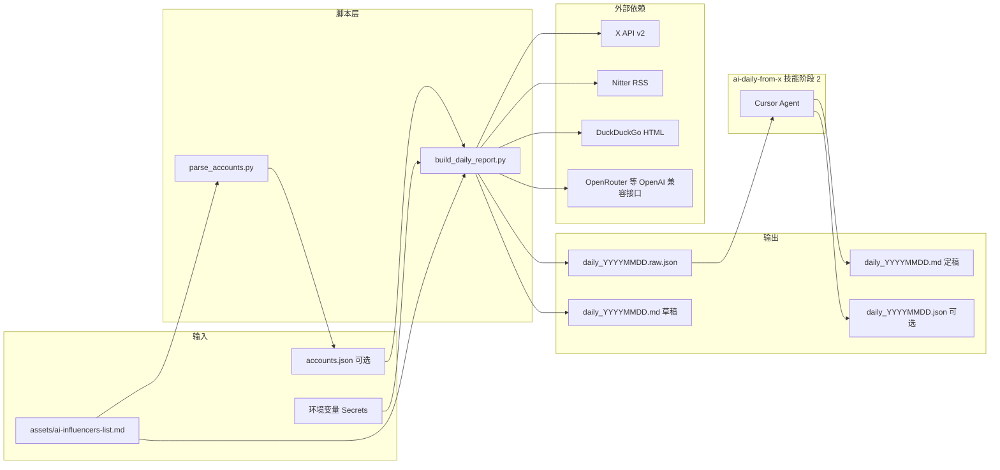

# AI 日报技能（ai-daily-from-x）实现说明

本文档描述 `.claude/skills/ai-daily-from-x` 的**技术方案、数据流、模块职责与实现原理**，便于维护、排错与二次扩展。执行入口与参数速查仍以根目录 `SKILL.md` 为准。

---

## 1. 目标与边界

**目标**：在指定「本地日历日」时间窗内，从一批 X（Twitter）账号拉取动态，经**规则评分、去重、可选英译中**后，产出事实包；再由 **`ai-daily-from-x` 技能阶段 2**（Agent 读 raw，见 `compose-readable-daily.md`）覆盖为可读 Markdown 日报。

**明确不做的事**：

- 阶段 1 **不使用**大模型做「采集」或「评分」（采集走 HTTP/RSS/搜索 HTML；评分为确定性关键词规则）。
- 阶段 1 **不使用**大模型生成价值点评（点评由技能阶段 2 的 Agent 撰写）。
- 不保证 Nitter 实例、DuckDuckGo HTML 结构长期稳定（第三方页面变化会导致回退路径失效）。
- 不在仓库内持久化翻译缓存文件（仅单次运行内对相同正文做内存 hash 复用）。

---

## 2. 总体架构

技能由 **两个 Python 脚本**、**一份评分规则文档**、**仓库级 GitHub Actions 工作流** 组成；与 Cursor/Claude 的交互关系是：**人类或 Agent 按 SKILL 调用脚本**，脚本不反向调用 IDE。



**分层理解**：

| 层级 | 职责 |
|------|------|
| 账号解析 | 从 Markdown 提取 `handle` 列表，落盘 JSON 供 CI 与本地复用 |
| 采集适配器 | 按账号依次尝试 X API → Nitter RSS → Web 搜索，统一为「帖子字典」 |
| 归一化与评分 | `to_signal`：字典 → `Signal`，附五维子分与加权总分 |
| 去重 | 按正文前缀规范化 key，保留高分优先 |
| 翻译增强 | 对去重后全集填 `text_zh`（可选） |
| 裁剪与渲染 | `min_score` + `top_n` 得到 `selected`；写 raw + 草稿 MD |
| 可读定稿（技能） | Agent 读 raw，按 `compose-readable-daily.md` 覆盖 MD |

---

## 3. 目录与文件职责

| 路径 | 职责 |
|------|------|
| `SKILL.md` | 技能元数据、触发场景、环境变量与产出格式约定 |
| `scripts/parse_accounts.py` | 从名单 Markdown 提取 handle，并合并 follow-builders JSON |
| `scripts/account_merge.py` | 共用：加载扩展 JSON、与主名单去重合并 |
| `scripts/build_daily_report.py` | 主流程：采集、评分、去重、翻译、写 MD/JSON |
| `references/scoring-rubric.md` | 评分维度、权重、P0/P1/P2 阈值的**产品层说明**（与代码公式应对照维护） |
| `references/implementation.md` | 本文档：架构与原理 |
| `references/compose-readable-daily.md` | 技能阶段 2：定稿 MD 结构与质量门禁 |
| 仓库 `.github/workflows/ai-daily-from-x.yml` | 手动触发阶段 1，上传 Artifact；定稿在 Cursor 走技能 |

---

## 4. 账号解析（parse_accounts.py + account_merge.py）

**原理**：用正则从 `assets/ai-influencers-list.md` 抽取两类模式：

1. 链接形态：`twitter.com/{handle}`（忽略大小写，handle 长度 1–15，符合 X 规则）。
2. 正文形态：`@handle`（使用负向后顾，避免匹配邮箱等片段）。

合并后按首次出现顺序去重，再与 **`assets/follow-builders-x-handles.json`**（与 follow-builders 技能 `x_accounts` 对齐）做 **小写去重合并**（主名单顺序优先；可用 `--no-merge` 跳过）。输出：

```json
{
  "source_file": "...",
  "merge_json": "... 或 null",
  "total_handles": N,
  "handles": ["a", "b"]
}
```

`build_daily_report.py` 优先读 `accounts.json`；若不存在或 `handles` 为空，则回退为直接读 Markdown 并 **同样合并** `follow-builders-x-handles.json`（与 `parse_accounts` 语义一致，逻辑在 `account_merge.py` 共用）。

---

## 5. 时间窗口（resolve_window）

**需求**：默认统计「报告时区下的昨日 00:00:00–23:59:59」，并转换为 **UTC** 供 X API 的 `start_time` / `end_time` 与 RSS `pubDate` 比较。

**实现要点**：

- 使用 `zoneinfo.ZoneInfo`（Python 3.9+）解析 `REPORT_TZ`（默认 `Asia/Shanghai`）。
- `REPORT_DATE=YYYY-MM-DD` 时固定该日；否则取「当前时刻在该时区下的日期减一天」。
- `end_local` 使用 `datetime.combine(day, time.max)` 覆盖到当日最后一纳秒级精度在库中的表示，再转 UTC。

**原理**：X API 要求 ISO8601 UTC；Nitter RSS 的 `pubDate` 由 `email.utils.parsedate_to_datetime` 解析，无时区则按 UTC 处理，再与 `[start_utc, end_utc]` 闭区间比较。

---

## 6. 采集层：三通道级联

对**每个** `handle` 顺序执行；一旦某通道返回非空列表，**不再尝试更弱通道**（避免重复与噪声）。

### 6.1 通道 A：X API v2（主路径）

**端点**：

1. `GET /2/users/by/username/{username}` → 拿 `user_id`。
2. `GET /2/users/{id}/tweets`，查询参数包括：
   - `start_time` / `end_time`（由 UTC 窗口格式化，且 `+00:00` 转为 `Z`）。
   - `tweet.fields=created_at,text,id`
   - `exclude=retweets,replies`（减少噪音）

**鉴权**：`Authorization: Bearer {X_BEARER_TOKEN}`。

**提前终止（熔断）**：若任一次 `users/by/username` 返回 HTTP **401 或 402**，设置全局标志 `api_skip_rest`，**后续所有账号不再请求 X API**。动机：套餐不可用或欠费时，逐账号重试只会放大 429 与无效流量；此时应尽快落到 Nitter / 搜索。

**成功时**：每条推构造 `url` 为 `https://x.com/{handle}/status/{id}`，`source=x_api`。

### 6.2 通道 B：Nitter RSS（API 不可用时的主回退）

**原理**：Nitter 是 X 的前端代理生态；多数实例提供 `https://{host}/{handle}/rss`。脚本拉取 XML，按 `<item>` 切分，解析 `<link>`、`<pubDate>`、`<title>`。

**时间过滤**：仅保留 `pub` 落在 `[start_utc, end_utc]` 的条目。

**链接还原**：`nitter_rss_link_to_x` 用正则从 Nitter 的 status URL 抽出用户名与 status id，改写成 `https://x.com/.../status/...`，便于读者点开官方页。

**实例列表**：环境变量 `NITTER_HOSTS` 逗号分隔，顺序尝试。**一旦某个 host 的 HTTP 请求成功拿到 XML**，即解析并 **`return` 本次结果**（窗内无帖则为空列表），**不再尝试后续 host**。仅当该 host 请求抛异常时，才 `continue` 试下一个 host。因此列表中应把**最稳定、最希望优先使用**的实例放在最前。

**注意**：Nitter 实例可用性依赖社区，RSS 里正文常为 **title 摘要级** 文本，信息量可能弱于 API 全文。

### 6.3 通道 C：DuckDuckGo HTML（末位回退）

**触发条件**：API 无结果且 Nitter 无结果，且全局 `fallback_used_handles` 未超过 `MAX_FALLBACK_HANDLES`（默认 12，控制搜索次数与被封风险）。

**原理**：构造查询 `site:x.com/{handle}/status {date} AI coding`，请求 DuckDuckGo 经典 HTML 结果页，正则提取链接与 snippet。

**链接解码**：DDG 常包装为 `/l/?uddg=...`，需 `parse_qs` + `unquote` 得到真实 `x.com/.../status/数字` URL。

**局限**：HTML 结构变化会导致匹配失败；发布时间无法可靠解析，代码用 `{date}T12:00:00Z` 占位，`source=websearch_fallback`。

---

## 7. 领域模型：Signal

`Signal` 为 `dataclass`，表示**一条已归一化的「信号」**，字段包括：

- 身份与内容：`handle`、`text`（原文）、`text_zh`（译文，可空）、`url`、`published_at`、`source`。
- 评分：`relevance`、`actionable`、`novelty`、`impact`、`timeliness`、`score`（加权总分）、`priority`（P0/P1/P2）。
- 展示辅助：`text_preview`、`topic_hints`（规则抽取）；**价值点评与行动建议由技能阶段 2 写入定稿 MD**，不在 raw 事实包中生成模板句。

**设计意图**：采集适配器只负责产出「最小字典」；`to_signal` 统一补全评分与文案，后续去重、翻译、裁剪都只操作 `Signal`，避免管道里多种 dict 形状。

---

## 8. 评分与分级原理

### 8.1 与 rubric 的关系

`references/scoring-rubric.md` 定义**人类可读**的维度含义与 P0/P1/P2 阈值；`build_daily_report.py` 中 `score_text` 实现为**轻量规则引擎**：对 `text.lower()` 做英文关键词命中计数，各维度在基准分上递增并 cap 到 10。

**加权公式**（与 rubric 一致）：

`score = 相关性×0.30 + 可执行性×0.25 + 新颖性×0.20 + 影响面×0.20 + 时效性×0.05`

**代码与文档的差异点**：当前实现里 `timeliness` 固定为 **8.5**（未按「是否落在窗口」动态降分），与 rubric 中「时效性」文字描述并不完全一致；若需严格对齐，可在未来接入 `published_at` 与窗口的偏差计算。

### 8.2 优先级

- `score >= 9.0` → P0  
- `8.0 <= score < 9.0` → P1  
- 否则 P2  

### 8.3 价值点评与行动建议

阶段 1 **不再**生成 `value_comment` / `action_suggestion`（已移除易误导的固定模板）。可读点评由 **阶段 2**（`references/compose-readable-daily.md`，Cursor + 技能）根据 `daily_*.raw.json` 撰写并覆盖 `daily_*.md`。

---

## 9. 去重（deduplicate）

**输入**：所有账号采集到的 `Signal` 列表。  
**步骤**：

1. 按 `score` **降序**排序，使同 key 先保留高分条。
2. 构造 key：`re.sub(r"\s+", " ", text.lower())[:100]`（小写、空白折叠、取前 100 字符）。
3. key 已出现则跳过。

**原理**：用前缀近似「同一帖」或「高度雷同的短文本」，避免附录与正文爆炸；**不是**语义级去重（若要 SimHash/嵌入聚类需另加模块）。

---

## 10. 翻译层（enrich_signals_zh）

**触发**：去重完成后，对 **`deduped` 全集**逐条处理（与 `selected` 无关，保证 JSON `all_candidates` 也带 `text_zh`）。

**逻辑顺序**：

1. **内存缓存**：`sha256(text.encode("utf-8"))` → 已译则 `dataclasses.replace` 只改 `text_zh`。
2. **中文占比**：CJK 字符比例 > 12% 视为「已偏中文」，`text_zh = text`，不调 API。
3. **无 API Key**：`text_zh = ""`。
4. **调用 LLM**：`POST {OPENROUTER_BASE_URL}/chat/completions`，OpenAI 兼容 JSON；`Authorization: Bearer {OPENROUTER_API_KEY}`；可选 `HTTP-Referer`。
5. **超长截断**：正文超过 `TRANSLATE_MAX_CHARS`（默认 8000）只送前段，并在译文后追加说明。
6. **节流**：`TRANSLATE_SLEEP_SEC` 默认 0.15s，降低限流概率。
7. **失败**：打印 stderr 日志，`text_zh` 置空，不中断整次构建。

**扩展**：`OPENROUTER_BASE_URL` 指向任意 OpenAI 兼容服务（如本机 Ollama 的 `/v1`）时，可共用同一套 POST 逻辑；密钥是否必填取决于该服务。

---

## 11. 裁剪与输出语义

### 11.1 selected 的生成

```text
selected = [s for s in deduped if s.score >= min_score][:top_n]
```

- `min_score`：默认 6.0，过滤低分噪声。  
- `top_n`：在达标条目中再截断长度，控制 MD 主文阅读量。

### 11.2 阶段 1 产物 vs 定稿 MD

| 文件 | 写入方 | 内容 |
|------|--------|------|
| `daily_*.raw.json` | Python | 全量候选、分数、`observation_top_n`，无技能点评 |
| `daily_*.md`（草稿） | Python | 采集摘要 + 候选索引表 + 技能定稿提示 |
| `daily_*.md`（定稿） | **ai-daily-from-x 技能** | 今日导读 / 精选 / 更多动态 / 采集说明（覆盖草稿） |
| `daily_*.json`（可选） | 技能 | `composed_by`、精选与 `value_comment` 等 |

**原理**：raw 供 Agent 只读推理；草稿 MD 供定时任务留痕；读者只看定稿 MD。

### 11.3 stats 与 translation 元数据

`stats` 含采集计数、`api_abort_reason`、`api_fail_handles`、`translation`（是否配置密钥、模型名、`text_zh` 非空条数）等，写入 JSON 并在 MD 执行摘要中展示关键项，便于一眼判断「今天数据从哪来、译了多少条」。

---

## 12. CI/CD 与本地运行

**工作流**（`.github/workflows/ai-daily-from-x.yml`）：

- 仅 `workflow_dispatch` 手动触发（定时已改本机 launchd）；可传 `report_date`。
- 注入 `X_BEARER_TOKEN`、`OPENROUTER_API_KEY` 等 Secrets；未配置的 secret 在 Actions 中为空字符串，行为与本地不导出变量一致。

**本地典型命令**：

```bash
python .claude/skills/ai-daily-from-x/scripts/parse_accounts.py \
  --input assets/ai-influencers-list.md --output output/ai-daily-from-x/accounts.json

python .claude/skills/ai-daily-from-x/scripts/build_daily_report.py \
  --accounts output/ai-daily-from-x/accounts.json \
  --source-md assets/ai-influencers-list.md \
  --output-dir output/ai-daily-from-x
```

**依赖**：标准库即可（`urllib`、`json`、`re`、`zoneinfo`、`dataclasses` 等），无需 `pip install` 额外包。

---

## 13. 失败模式与排错提示

| 现象 | 可能原因 | 排查方向 |
|------|----------|----------|
| `api_abort_reason: http_402` | X 套餐或计费问题 | 确认令牌与产品线；依赖 Nitter/搜索 |
| 全文空或极少 | Nitter 实例失效、DDG HTML 变更 | 换 `NITTER_HOSTS`；检查网络 |
| 429 | 请求过频 | 熔断后应跳过 API；减账号或加间隔（需改代码） |
| `text_zh` 全空 | 未配置 Key 或接口错误 | 看 stderr；检查 `OPENROUTER_*` |
| MD 比 JSON 「少很多」 | 设计如此 | 看 `selected` vs `all_candidates` 与附录上限 |

---

## 14. 扩展建议（未实现）

- **语义去重**：SimHash / MinHash / 小模型嵌入聚类。  
- **时效性动态分**：用 `published_at` 与窗口中心偏差修正 `timeliness`。  
- **翻译持久化缓存**：跨日相同推文 hash 落盘，节省费用。  
- **采集插件化**：抽象 `Fetcher` 协议，便于加官方 ActivityPub 或其它源（若未来开放）。

---

## 15. 技能阶段 2（可读定稿）

阶段 1 结束后，由 Cursor 激活 **`ai-daily-from-x` 技能**（非 Python 脚本）：

1. 读取 `daily_{YYYYMMDD}.raw.json`（禁止改写）。
2. 遵循 `references/compose-readable-daily.md` 覆盖 `daily_{YYYYMMDD}.md`。
3. 交付前执行 compose 文档中的质量门禁自检。

用户说「生成 AI 日报」且未限定「只采集」时，Agent 应默认执行阶段 1（若 raw 不存在）并接着完成阶段 2。详见 `SKILL.md`「技能执行总则」。

---

## 16. 版本维护建议

修改 `score_text` 权重或关键词时，请**同步更新** `references/scoring-rubric.md`，避免文档与代码漂移；反之亦然。新增环境变量或定稿结构变更时，同步 `SKILL.md`、`compose-readable-daily.md` 与本文件。
